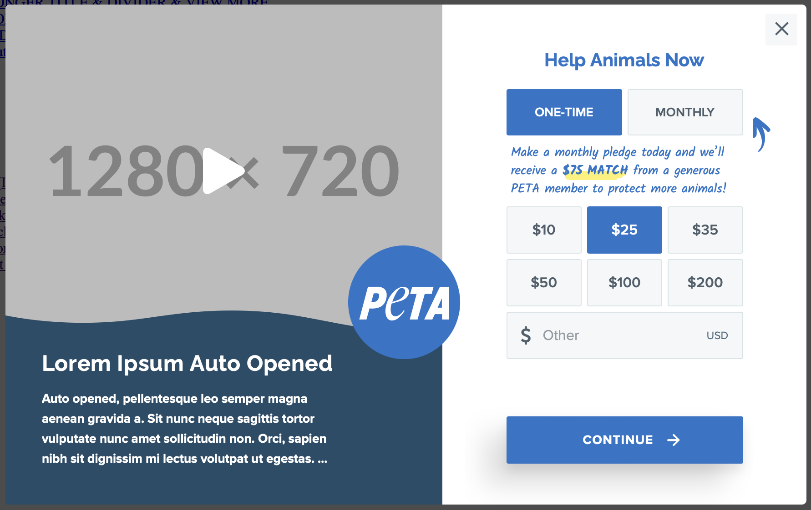

# 4Site's ENGrid Multistep Donation Page Template

This project is used for the PETA Engaging Networks Multistep Donation Page.
It can be used as a lightbox, post-action, or embedded iFrame.

## Engaging Networks Library Items

1. MDP - iFrame Redirect
   A Code Block that redirects the user to an alternative page if the user accesses the page directly.
2. MDP - Title
   A Text Block that sets the title of the page.
3. MDP - Appeal Code
   A Form Block that sets the appeal code of the page.
4. MDP - Recurring Fields
   A Form Block that sets the recurring fields of the page.
5. MDP - Monthly Nudge
   A Text Block for the monthly nudge message.
6. MDP - Donation Amount
    A Form Block for the donation amount buttons.
7. MDP - Personal Information Title
    A Text Block for the personal information title.
8. MDP - Personal Information Fields
    A Form Block for the personal information fields. 
9. MDP - Sign Up Message
    A Text Block for the sign up message.
10. MDP - Sign Up Message Canada Only
    A Text Block for the sign up message for Canada only.
11. MDP - Sign Up Fields
    A Form Block for the sign up fields.
12. MDP - Unsubscribe Message Canada Only
    A Text Block for the unsubscribe message for Canada only.
13. MDP - Payment Type Title
    A Text Block for the payment type title.
14. MDP - Express Checkout Title
    A Text Block for the express checkout title.
15. MDP - Express Checkout Buttons
    A Form Block for the express checkout (digital wallets) buttons.
16. MDP - Express Checkour "OR" Text
    A Text Block for the express checkout "OR" text.
17. MDP - Other Payment Options
    A Code Block for the other payment options.
18. MDP - Payment Information Title
    A Text Block for the payment information title.
19. MDP - Payment Information Fields
    A Form Block for the payment information fields.
20. MDP - Credit Card Flags
    A Text Block for the credit card flags.
21. MDP - Billing Address Title
    A Text Block for the billing address title.
22. MDP - Billing Address Fields
    A Form Block for the billing address fields.
23. MDP - Submit Button
    A Form Block for the submit button.